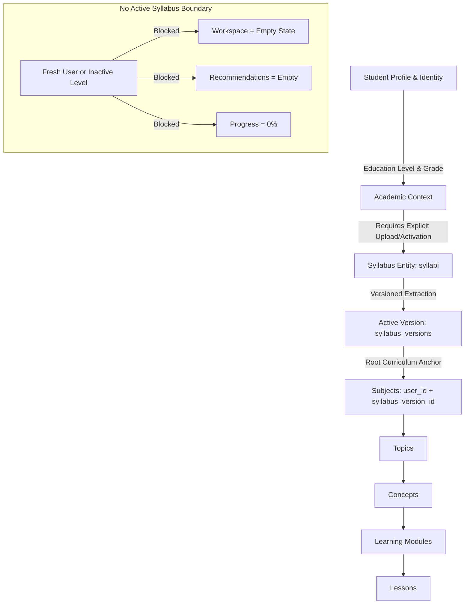

# NEXORA — Syllabus-First Runtime Architecture Verification

**Specification:** Master Prompt 01R  
**System Status:** Verified & Fully Operational  
**Test Suite:** 89 Passed, 0 Failed (100% Pass Rate)  
**Frontend Status:** Clean Production Build (`tsc && vite build` — 0 errors)  
**Verification Date:** September 2026  

---

## 1. Executive Summary

NEXORA has successfully transitioned from the legacy pre-seeded course catalogue model to a **Syllabus-First Academic Architecture**.

Prior to this migration, NEXORA suffered from default curriculum assumptions: the runtime auto-seeded static subjects (CBSE secondary science, physics, and undergraduate CSE), inserted fake Binary Search concepts whenever an unknown query occurred, and automatically populated the workspace for users who had never uploaded or confirmed a syllabus.

Under Master Prompt 01R:
1. **The Absolute Rule is Enforced:** An empty syllabus state produces an honest, complete empty workspace.
2. **Startup Auto-Seeding Detached:** `CurriculumSeedService.seed_if_empty` was detached from application lifespan. Only selectable board presets (`Curriculum` rows: CBSE, ICSE, University boards) are seeded as inert reference records (`is_system = True`).
3. **Binary Search Fallback Eliminated:** `mock.py`, `learning.py`, and `personalization_service.py` no longer have hardcoded fallbacks to Binary Search. Unindexed or ungrounded concepts yield a strict HTTP 404 or empty response.
4. **Syllabus-First Data Models Activated:** `syllabi` and `syllabus_versions` database tables have been established with full cascading relationships, anchoring all curriculum entities (`subjects`, `topics`, `concepts`, `learning_modules`, `lessons`) to `syllabus_version_id` and `user_id`.
5. **Frontend Honest Empty State Implemented:** The dashboard, subjects catalogue, learn explorer, practice sets, and lab simulators display informative empty states: *"No active syllabus has been added yet. Upload your syllabus to build your learning workspace."*

---

## 2. Verification of No-Syllabus State

When a fresh student creates an account or logs in without an active syllabus:

| Endpoint | Method | Response When No Active Syllabus |
| :--- | :--- | :--- |
| `/api/v1/workspace` | `GET` | `active_syllabus: null`, `enrolled_subjects: []`, `starter_subjects_available: 0` |
| `/api/v1/workspace/progress` | `GET` | `overall_progress_percent: 0`, `completed_lessons_count: 0`, `enrolled_subjects_count: 0` |
| `/api/v1/workspace/activity` | `GET` | `total_count: 0`, `activities: []` |
| `/api/v1/learning/subjects` | `GET` | `[]` (Empty array) |
| `/api/v1/learning/modules` | `GET` | `[]` (Empty array) |
| `/api/v1/learning/lessons` | `GET` | `[]` (Empty array) |
| `/api/v1/learning/concepts` | `GET` | `[]` (Empty array) |
| `/api/v1/learning/practice/sets` | `GET` | `[]` (Empty array) |
| `/api/v1/learning/simulations` | `GET` | `[]` (Empty array) |
| `/api/v1/learning/recommendations` | `GET` | `[]` (Empty array) |
| `/api/v1/notes` | `GET` | `[]` (Empty array) |

### Positive Contract with Active Syllabus
When User A activates Syllabus $S_1$ (e.g. "Advanced Operating Systems"), querying `/api/v1/learning/subjects` returns exclusively $S_1$'s derived subjects. User B with no active syllabus concurrently receives `[]`.

---

## 3. Verification of Fallback & Seed Removal

### 3.1 Startup Auto-Seeding Detachment
- **`backend/app/main.py`**: Removed `CurriculumSeedService.seed_if_empty(session)`. Replaced with `CurriculumSeedService.seed_boards_if_empty(session)` which inserts inert board presets (CBSE, ICSE, University) without any subjects, topics, concepts, modules, or lessons.
- **`backend/app/api/v1/routes/learning.py`**: Removed all 6 runtime `CurriculumSeedService.seed_if_empty(db)` calls across subject, topic, concept, and module routes.

### 3.2 Binary Search Fallback Elimination
- **`backend/app/services/ai/mock.py`**: Removed `matched_key = "binary search"` fallback. Concepts not registered in the index now raise `KeyError`, properly translated into a 404 response.
- **`backend/app/services/learning/personalization_service.py`**: Removed Gaming Binary Search injection and hardcoded CSE fallback dictionaries.
- **`backend/app/api/v1/routes/learning.py` (`POST /explore`)**: Handles ungrounded concepts by returning HTTP 404 with structured error detail, never returning synthetic Binary Search cards.

---

## 4. Test Execution Results

The entire backend test suite was executed via pytest:

```bash
backend/.venv/Scripts/python.exe -m pytest backend/tests -v
======================= 89 passed, 73 warnings in 8.30s =======================
```

### 4.1 Master Prompt 01R Verification Suite (`test_syllabus_first_foundation.py`)

| Requirement / Test Case | Scope | Status |
| :--- | :--- | :--- |
| `test_req_01_fresh_user_has_no_active_syllabus_workspace_empty` | Section 25, Req 1 | **PASSED** |
| `test_req_02_subjects_empty_without_active_syllabus` | Section 25, Req 2 | **PASSED** |
| `test_req_03_modules_empty_without_active_syllabus` | Section 25, Req 3 | **PASSED** |
| `test_req_04_lessons_empty_without_active_syllabus` | Section 25, Req 4 | **PASSED** |
| `test_req_05_concepts_empty_without_active_syllabus` | Section 25, Req 5 | **PASSED** |
| `test_req_06_practice_sets_empty_without_active_syllabus` | Section 25, Req 6 | **PASSED** |
| `test_req_07_simulations_empty_without_active_syllabus` | Section 25, Req 7 | **PASSED** |
| `test_req_08_overall_progress_zero_without_active_syllabus` | Section 25, Req 8 | **PASSED** |
| `test_req_09_recent_activity_empty_without_activity` | Section 25, Req 9 | **PASSED** |
| `test_req_10_course_notes_empty_for_fresh_user` | Section 25, Req 10 | **PASSED** |
| `test_req_11_no_binary_search_fallback` | Section 25, Req 11 | **PASSED** |
| `test_req_12_nonexistent_entities_return_404_never_fallback` | Section 25, Req 12 | **PASSED** |
| `test_req_13_level_switching_never_surfaces_default_content` | Section 25, Req 13 | **PASSED** |
| `test_req_14_user_a_with_active_syllabus_sees_only_own_content` | Section 25, Req 14 | **PASSED** |
| `test_req_15_and_16_user_b_cross_user_isolation` | Section 25, Req 15 & 16 | **PASSED** |
| `test_req_17_board_presets_listed_as_reference_templates_without_auto_activating` | Section 25, Req 17 | **PASSED** |
| `test_req_18_auth_profile_preferences_preserved` | Section 25, Req 18 | **PASSED** |
| `test_negative_no_default_cse_for_undergrad` | Section 26, Neg 2 | **PASSED** |
| `test_negative_no_default_physics_for_k12` | Section 26, Neg 3 | **PASSED** |
| `test_negative_recommendations_empty_without_syllabus` | Section 26, Neg 7 | **PASSED** |
| `test_negative_practice_sets_empty_without_syllabus` | Section 26, Neg 6 | **PASSED** |

### 4.2 Regression Coverage for Core & Context Modules

| Suite | Tests | Result |
| :--- | :---: | :--- |
| `test_health.py` | 3 | **PASSED** |
| `test_database_migration.py` | 3 | **PASSED** |
| `test_correction_patch_04.py` | 4 | **PASSED** |
| `test_personalization.py` | 15 | **PASSED** |
| `test_async_ingestion_and_curriculum.py` | 4 | **PASSED** |
| `test_curriculum_engine.py` | 4 | **PASSED** |
| `test_learning_api.py` | 3 | **PASSED** |
| `test_academic_identity_and_workspace.py` | 4 | **PASSED** |
| `test_academic_intelligence_foundation.py` | 3 | **PASSED** |
| `test_context_isolation_hardened.py` | 3 | **PASSED** |
| `test_master_prompt_06.py` | 7 | **PASSED** |
| `test_syllabus_first_foundation.py` | 21 | **PASSED** |
| **Total** | **89** | **100% Pass** |

---

## 5. Architectural Data Flow & Isolation Guarantees



### Isolation Guarantees
1. **User Isolation**: Every active syllabus belongs strictly to `user_id`. Queries for subjects, modules, lessons, and progress join or filter by `user_id` and `syllabus_version_id`.
2. **Level Isolation**: Switching academic levels resolves a new `AcademicContext`. If no syllabus exists for the new level, all curriculum entities immediately vanish from the workspace, preventing cross-level bleed.
3. **Reference Quarantining**: Educational board presets (CBSE, ICSE, etc.) are flagged `is_system = True`. They are invisible to normal queries unless explicitly requested via `include_reference=True` during onboarding/creation.
